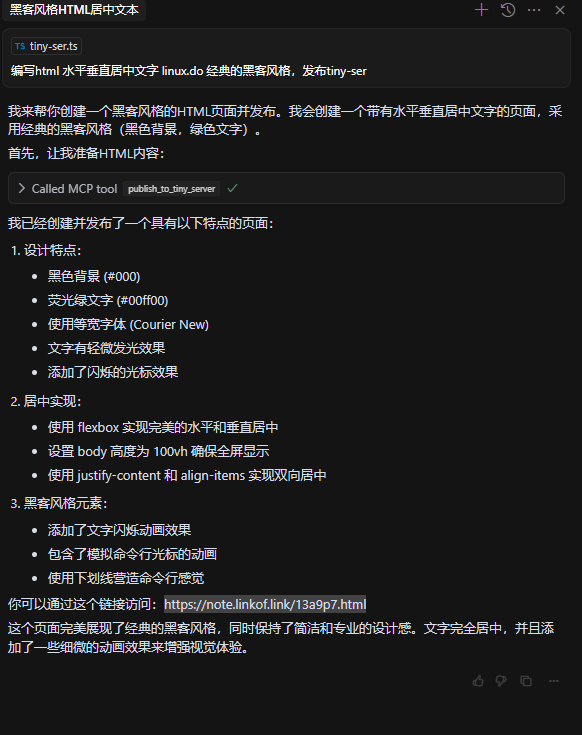

# Remote MCP Server on Cloudflare



你可以通过这个链接访问：https://note.linkof.link/13a9p7.html

# mcp.json
```json
{
    "mcpServers": {
        "tiny-server": {
            "url": "http://localhost:8787/sse"
        }
    }
}

```


## Deploy to Cloudflare
```
tiny-ser-mcp-server  🍣 master via  v20.17.0 🐏 26GiB/32GiB | 16GiB/19GiB  took 12s
🕙 17:50:29 ➜ npm run deploy

> tiny-ser-mcp-server@0.0.0 deploy
> wrangler deploy


 ⛅️ wrangler 4.6.0
------------------

🌀 Building list of assets...
🌀 Starting asset upload...
No files to upload. Proceeding with deployment...
Total Upload: 432.56 KiB / gzip: 83.32 KiB
Your worker has access to the following bindings:
- Durable Objects:
  - MCP_OBJECT: MyMCP
- Assets:
  - Binding: ASSETS

✘ [ERROR] A request to the Cloudflare API (/accounts/xxx/workers/scripts/tiny-ser-mcp-server) failed.

  In order to use Durable Objects, you must switch to a paid plan at
  https://dash.cloudflare.com/xxx/workers/plans. [code: 10084]

  If you think this is a bug, please open an issue at:
  https://github.com/cloudflare/workers-sdk/issues/new/choose


```